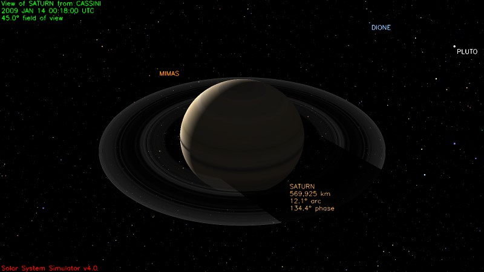
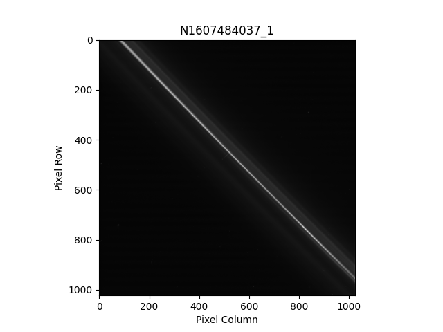

# Cassini Tools - Image and Metadata Processing

This repository contains the following files:

## image_model.py

**Description**: 
The `image_model.py` file downloads a simulation of the given image from http://space.jpl.nasa.gov/. Please edit the file with the HTML of your desired image from https://pds-imaging.jpl.nasa.gov/search/. 

Much of the code was given by https://github.com/kmgill/cassini_processing, but changes were made to avoid the requirement of the ISIS3 software. 
### Usage: get_model.py [-h] -d DATA [-f FOV] [-p PCT]

```python 
optional arguments:
  -h, --help            show this help message and exit
  -f FOV, --fov FOV     Field of view (angle)
  -p PCT, --pct PCT     Body width as percentage of image

```
### Sample Image: <br><br>  

## image_model.py

**Description**: 
The `image_extract.py` file extracts images from https://pds-imaging.jpl.nasa.gov/search/ and plots them using rasterio. The image metadata is written to an output file with the image_id. Read [Rasterio Plotting](https://rasterio.readthedocs.io/en/latest/topics/plotting.html) for further analysis tools. 

### Sample Image: <br><br>  

## metadata_extract.py
The `metadata_extract.py` file extracts the metadata from the index.tab for a given volume (please paste html within the file) and outputs them into a csv with the volume_id and labeled columns given by the index.lbl. 

